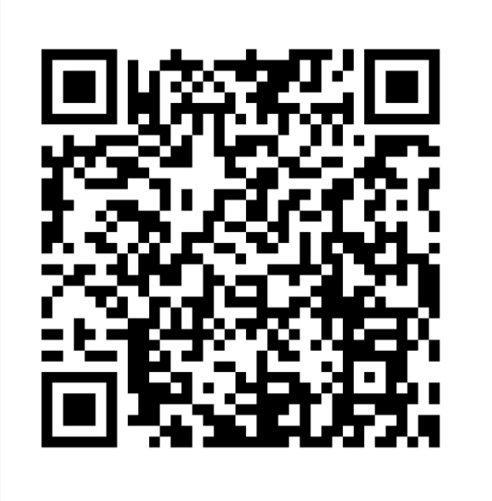

# Halal Check Japan 

Halal Check Japan is a LINE bot that read Japanese text in images and filter out any haram or syubhah substances from it. 
It aims to help anyone who can't read Japanese to check ingredients of any Japanese products.
The first version is an app which was built using Flutter but because of the simplicity of the functions, I decided to convert it into a bot.

## Demo

  
  &nbsp; &nbsp; &nbsp; &nbsp; &nbsp;
  

## Installation

There is 3 ways to use this bot.
1. Add friend in LINE app using this QR code.
2. Add friend in LINE app using id: @635pqsrn
3. Add friend in LINE app using a shared contact from friend.

## Technology
#### Google Apps Script
The source code is hosted in GAS because I am familiar with it and has been used it in my work.

#### Line Messenging API
  - Get the images that user upload to LINE.
  - Send it to Google Cloud Vision in Base64 format.
  - Reply back the result to the user.

#### Google Cloud Vision API
Detect any text in images using pre-trained machine learning model from Google.
